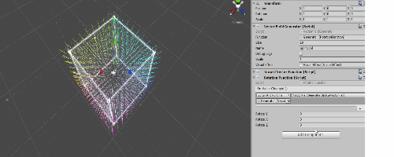

# Vectorfield-Project

A tool for Unity3D that generates Vectorfields.

Currently 2 modes

## VFX Vectorfield

To use in the new VFX features using swarm behaviour

## Draw in particle

This will create a vectorfield with the shape of your drawing.

